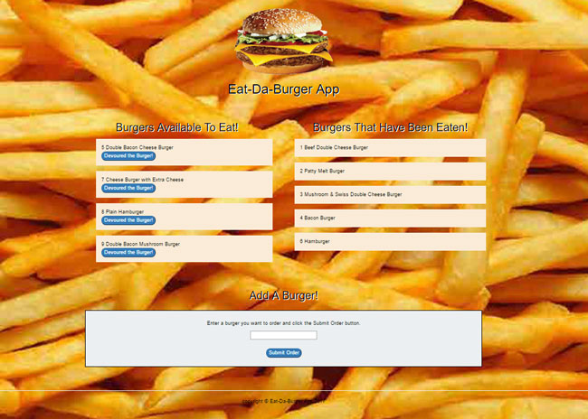

#  Eat-Da-Burger App 
The object is to create a burger logger with MySQL, Node, Express, Handlebars and a homemade ORM. Being sure to follow the MVC design pattern; use Node and MySQL to query and route data in the app, and use Handlebars to generate your HTML.

# 

## Link to App
**https://obscure-escarpment-25442.herokuapp.com/**

### How The App Should Work
Eat-Da-Burger! is a restaurant app that lets users input the names of burgers they'd like to eat.
Whenever a user submits a burger's name, your app will display the burger on the left side of the page -- waiting to be devoured.
Each burger in the waiting area also has a Devour it! button. When the user clicks it, the burger will move to the right side of the page.
Your app will store every burger in a database, whether devoured or not.

## Installation
- Clone repo locally -> `cd` into project folder.
- Run `npm install` to install dependencies locally.
- Log into localhost mysql shell and source `db/schema.sql` and `db/seeds.sql` files in order to create and load initial database data.
  - To do this within mysql shell, use the command `source /FULL_PATH_HERE/schema.sql`
- Run with `node server.js`.
- Enjoy eating burgers <3

----------

JIMMY NGUYEN (C) 2017. All Rights Reserved.